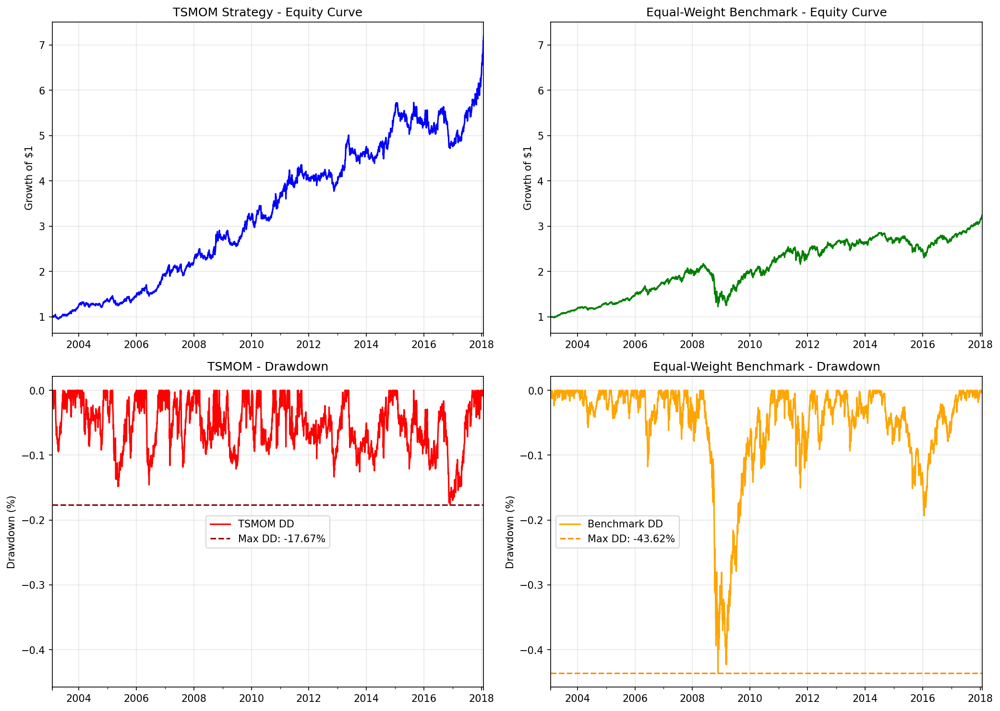

# Time Series Momentum Strategy (TSMOM)

## Overview

This project implements a time-series momentum (TSMOM) trading strategy across a basket of ETFs.
The strategy generates directional signals based on past returns and scales positions using volatility targeting.

## Motivation

Time-series momentum is a well-documented phenomenon in financial markets and is widely used in systematic macro and CTA strategies.
This project aims to replicate and evaluate such a strategy in a simplified setting.

## Methodology

* Multi-horizon momentum signals (1, 3, 6, 12 months)
* Signal aggregation via sign of returns
* Volatility targeting for position sizing
* Rolling walk-forward backtest of 3 years of training followed by a year of testing
* Metrics compared against a strategy of idendical holdings without signals or volatility weighing 

## Results


| Metrics | TSMOM | Benchmark |
| -------- | -------- | ------|
| Annualized Return | 13.82% | 8.64% |
| Sharpe Ratio    | 0.9274 | 0.5928 |
| Maximum Drawdown | 17.67% | 43.62% |

## Key Insights

* Momentum signals show persistent predictive power
* Volatility targeting stabilizes returns
* Performance is sensitive to lookback window selection

## Limitations

* No transaction costs included
* Limited asset universe
* Parameter sensitivity not fully explored

## How to Run

```bash
pip install -r requirements.txt
python __main__.py
```

## Repository Structure

* `notebooks/` – research notebook
* `src/` – strategy implementation
* `data/` – input datasets
* `results/` – generated outputs

